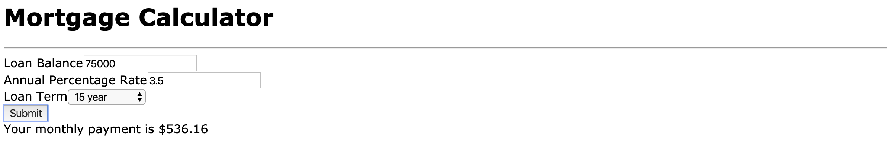

# React100-Mortgage-Calculator



This project is a simple mortgage loan calculator to determine monthly payments taking balance, interest, 
and term in years into account to calculate a monthly payment.

## Please feel free to demo the project by taking these steps..
```
Clone or fork the repo
```
```
npm install
```
```
npm start
```
```
Open your browser to view on localhost: 3000
```
* **Thank you**, ***-Miles Mickelson***
